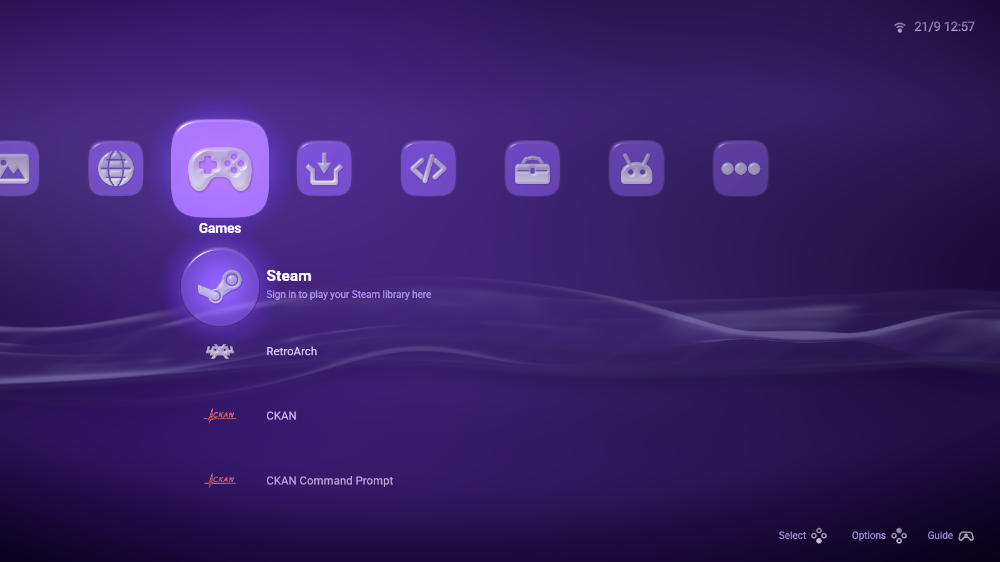
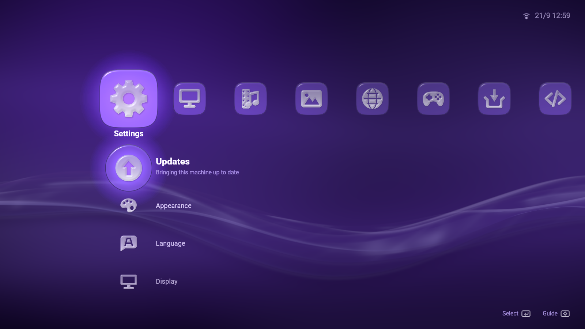
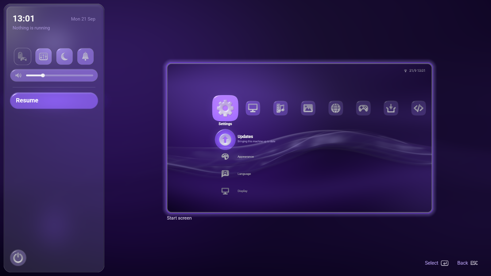

# LineXinBar

**A console-style Linux desktop for your games, apps and media.**

LineXinBar pairs a lightweight Wayland compositor with a controller-friendly
launcher. Browse your library, open desktop apps and switch between screens
from one interface, using a gamepad, keyboard or mouse.

[Get started](#get-started) · [Documentation](docs/index.md) · [Report a bug](https://github.com/Petexy/LineXinBar/issues)



## Why LineXinBar?

- **A desktop you can use from the couch.** Browse apps, music, videos and
  pictures with a controller, with an on-screen keyboard when you need to type.
- **Your games in one place.** Browse your Steam library and launch games through
  Steam, with optional RetroArch integration for your own console games.
- **Multiple displays, independently.** Each screen runs at its own resolution
  and refresh rate, with controls for moving between them.
- **A guide a button away.** Switch apps, adjust volume and brightness, or get
  back to the launcher with the controller’s guide button or the Super key.
- **Make it yours.** Choose an accent, theme and wallpaper, including animated
  wallpapers, and configure displays and sound from Settings.
- **Desktop essentials included.** File browsing, screenshots, screen sharing
  and system updates live alongside your apps.

## Screenshots

| Desktop settings | Guide and quick settings |
| --- | --- |
|  |  |

Captured from a nested session of the project’s local release build.
[View full-size screenshots](docs/screenshots/gallery.md).

## Get started

LineXinBar runs on **Linux**. A native session needs a working GPU driver and
**systemd-logind or seatd**. You can also try it in a window inside your existing
desktop.

**Build a package:** recipes are included for
[Arch Linux, Debian/Ubuntu, Fedora and Nix/NixOS](docs/packaging.md).
Install the compositor and desktop packages, then select **LineXinBar** in your
login screen.

**Try it from source:** install Rust **1.89 or newer** and the
[build dependencies](docs/getting-started.md#building), then run from the checkout:

```sh
./scripts/run-nested.sh
```

The script builds the project and opens a nested desktop with its own session
bus. To build without launching it:

```sh
cargo build --release --locked
```

See [Getting started](docs/getting-started.md) for native sessions, dependency
lists and testing with multiple virtual displays.

## Basic controls

| Action | Keyboard | Controller |
| --- | --- | --- |
| Browse | Arrow keys | D-pad / left stick |
| Select | Enter | Bottom face button |
| Open the guide | Super / Windows key | Guide / Home button |
| Take a screenshot | Print Screen | Guide + right bumper |
| Quit the session | Ctrl+Alt+Backspace | Guide → power menu → Log out |

[All controls](docs/controls.md) · [Configuration](docs/configuration.md)

## Project status

LineXinBar is in **early development**. Hardware testing has primarily covered
one AMD GPU with two displays; other GPU vendors and multi-GPU setups need more
validation. Steam games require Valve’s Steam client, and RetroArch integration
is an optional package. See [known limitations](docs/overview.md#not-implemented)
before relying on it as your daily desktop.

## Learn more and contribute

The [documentation index](docs/index.md) covers setup, Steam, RetroArch,
settings, desktop features and the technical reference. Bug reports, hardware
testing, translations and code contributions are welcome. When reporting a
problem, include your distribution, GPU, how you started LineXinBar and relevant
logs.

Licensed under [GPL-3.0-only](LICENSE).
